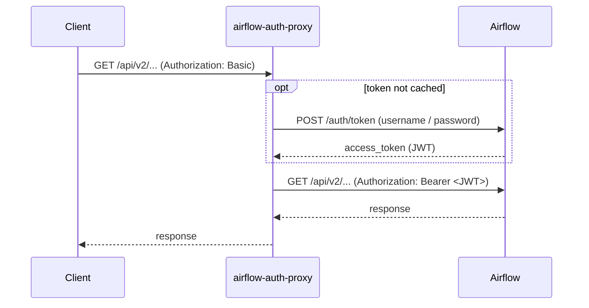

# airflow-auth-proxy

A reverse proxy that lets client programs keep talking to the
[Apache Airflow](https://airflow.apache.org/) REST API over HTTP **Basic auth**,
even though
[JWT token authentication](https://airflow.apache.org/docs/apache-airflow/stable/security/jwt_token_authentication.html)
became mandatory in
[Airflow 3.0.0](https://airflow.apache.org/docs/apache-airflow-providers-fab/stable/auth-manager/api-authentication.html).
The proxy exchanges the client's Basic credentials for the JWT the API now
requires, so existing clients keep using Basic auth unchanged instead of being
rewritten to obtain and refresh JWTs.

## How it works



1. The client sends its API request to the proxy with
   `Authorization: Basic <user:pass>`.
2. To authenticate that request the proxy needs a JWT, so it exchanges the Basic
   credentials for one at Airflow's `/auth/token` endpoint. The token is
   **cached** (keyed by a hash of the credentials), so this exchange happens only
   on the first request per credential set (concurrent misses are collapsed into
   a single exchange). This step is skipped whenever a cached token is available.
3. The proxy then forwards the client's **original** API request to Airflow with
   `Authorization: Bearer <jwt>` (the inbound Basic header never reaches
   Airflow), and relays Airflow's response back to the client.
4. If Airflow rejects the token with `401` (e.g. it expired), the proxy drops the
   cached token, fetches a fresh one, and replays the request once.

The proxy listens in plaintext (see [TLS](#tls)) and shuts down gracefully on
`SIGINT` / `SIGTERM`.

## Requirements

- Go 1.22 or newer (to build).
- An Airflow 3.0.0 or newer instance exposing `/auth/token` and the REST API.

## Build

```sh
go build -o airflow-auth-proxy .
```

## Usage

```sh
airflow-auth-proxy -airflow-url https://airflow.internal
```

Point clients at the proxy using Basic auth:

```sh
curl -u "$AIRFLOW_USER:$AIRFLOW_PASSWORD" http://localhost:8080/api/v2/dags
```

### Flags

| Flag           | Default       | Description                                                        |
| -------------- | ------------- | ----------------------------------------------------------------- |
| `-airflow-url` | *(required)*  | Base URL of the Airflow instance, e.g. `https://airflow.internal`. |
| `-listen`      | `:8080`       | Address to listen on (plaintext).                                 |
| `-token-path`  | `/auth/token` | Path to the Airflow auth token endpoint.                          |
| `-timeout`     | `30s`         | Upstream request timeout.                                         |

## TLS

The proxy listens in plaintext by design. TLS is expected to be handled by an
external component in front of it.

## End-to-end test

`e2e/test_e2e.py` drives the proxy as a real consumer would, speaking only Basic
auth, against a running Airflow, and asserts the observable contract. It uses the
Python standard library only.

1. Bring up Airflow with the official Docker Compose setup:
   <https://airflow.apache.org/docs/apache-airflow/stable/howto/docker-compose/index.html>
   (default credentials `airflow` / `airflow`).
2. Start the proxy against it:

   ```sh
   ./airflow-auth-proxy -listen 127.0.0.1:8081 -airflow-url http://localhost:8080
   ```

3. Run the test:

   ```sh
   PROXY_URL=http://127.0.0.1:8081 AF_USER=airflow AF_PASS=airflow python3 e2e/test_e2e.py
   ```

## License

This project is licensed under the [MIT License](LICENSE).
